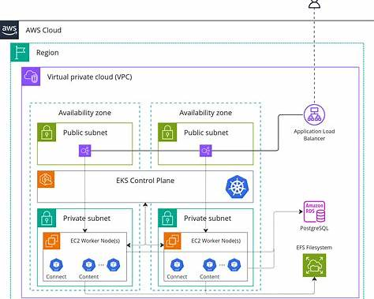

# K8s Deployment on AWS with Terraform

## Decisions & scope

- **Cloud:** AWS
- **Region:** e.g. ap-southeast-1
- **K8s:** v1.31 (kubeadm)
- **CNI:** Calico (VXLAN) with podCIDR = 192.168.0.0/16
- **Nodes:** 1× control plane (t3.small), 2× workers (t3.small)
- **Runtime:** containerd (SystemdCgroup=true)
- **Access:** AWS SSM Session Manager (no public SSH)
- **Service exposure:** NodePort to start; add AWS Load Balancer Controller later if you want real LBs
- **Storage:** EBS CSI driver (default StorageClass = gp3)
- **State:** Terraform S3 backend + DynamoDB lock

---

## Diagram

<div>
    
</div>


```nginx
AWS Cloud
 └─ VPC 10.100.0.0/16
     ├─ Public Subnet (10.100.0.0/20)
     │    └─ NAT Gateway → Internet Gateway
     └─ Private Subnet AZ1 (10.100.32.0/20)
          ├─ Control Plane EC2 (t3.medium)
          └─ Private Subnet AZ1 (10.100.48.0/20)
               ├─ Worker EC2 #1 (t3.small)
               └─ Worker EC2 #2 (t3.small)
```

---

## Bootstrap Terraform state

- **Goal:** remote state & locking so changes are safe.
- Create S3 bucket (e.g., tfstate-yourname-prod) and DynamoDB table (e.g., tfstate-locks, key LockID).
- Configure backend.tf:
    - bucket, key (e.g., kubeadm/main.tfstate), region, dynamodb_table.
- **Acceptance check:** terraform init switches to the remote backend with no errors.

---

## Repo layout
```markdown
terraform/
  backend.tf
  providers.tf
  variables.tf
  outputs.tf

  vpc.tf
  security_groups.tf
  iam.tf
  ssm.tf
  ec2_control_plane.tf
  ec2_workers_asg.tf

  user_data/
    control-plane.sh.tmpl
    worker.sh.tmpl

k8s/
  addons/
    metrics-server.yaml
    (Helm notes for EBS CSI & AWS LB Controller)
README.md
```

---

## Network layer
- **Goal:** a VPC with subnets & egress so nodes can pull images and reach AWS APIs.
- VPC /16 (e.g., 10.100.0.0/16)
- Subnets: 2× private /20 (for CP & workers), 2× public /20 (for NAT or LBs)
- IGW + 1× NAT Gateway (cost-aware)
- Routes: private subnets route 0.0.0.0/0 → NAT; public → IGW
- **Acceptance check:** subnets & routes exist; NAT in a public subnet.

---

## Security Groups
- **Goal:** allow cluster internals; keep the surface tight.
- One SG (attach to all nodes):
    - Ingress (self → self): allow all (nodes/pods/control plane talk)
    - Ingress (optional): NodePort 30000–32767 from your IP for quick testing
    - Egress: allow all
- (SSH not required if using SSM; otherwise add port 22 from your IP)
- **Acceptance check:** SG created; rules present.

---

## IAM & SSM
- **Goal:** instances manageable via SSM; later enable IRSA for controllers.
- EC2 instance role + instance profile:
    - Attach AmazonSSMManagedInstanceCore
- (Later) OIDC provider + IAM roles for:
    - EBS CSI driver
    - AWS Load Balancer Controller
- **Acceptance check:** you can start an SSM session to any instance you launch with this profile.

---

## Images & instance sizing
- **Goal:** Ubuntu 22.04 AMI, types:
- Control plane: t3.medium (2 vCPU, 4 GiB)
- Workers: t3.small (2 vCPU, 2 GiB) × 2 (min/desired), scale as needed
- **Acceptance check:** AMI data source resolves a recent jammy image.

---

## User data (cloud-init) templates
- **Goal:** every node comes up with containerd + kube* packages installed.
- Common (both templates):
    - Disable swap; set sysctls (bridge-nf, ip_forward)
    - Install containerd, generate config, set SystemdCgroup=true
    - Add Kubernetes repo for v1.31; install kubelet, kubeadm, kubectl and hold them
    - Write /etc/crictl.yaml pointing to containerd (handy)
- Control-plane script:
    - Discover private IP (169.254.169.254 metadata or env)
    - `kubeadm init --apiserver-advertise-address=<private-ip> --pod-network-cidr=192.168.0.0/16`
    - Copy /etc/kubernetes/admin.conf to ubuntu user
    - Apply Calico manifest (and optionally an explicit IPPool for VXLAN on the same CIDR)
    - Generate secure join token & CA hash; write the exact kubeadm join ... to /root/join.sh
- Worker script (secure join):
    - Fetch the official join command from a secure place (see step 8), then execute it
- **Acceptance check:** after boot, kubectl get nodes (via SSM onto CP) shows Ready for the control plane once Calico settles.

---

## Secure join wiring
- **Goal:** workers auto-join using the real CA cert hash.
- Two simple patterns:
    - A) Parameter Store approach (recommended for labs):
        - After the CP finishes init, run a one-time SSM command on the CP that does: `cat /root/join.sh` and puts it into SSM Parameter Store (SecureString).
        - Worker user data: Uses instance IAM role to `aws ssm get-parameter --with-decryption` to fetch `join.sh` `bash join.sh`
    - B) S3 object (private) approach:
        - Same idea but write/read from an encrypted S3 object with a tight bucket policy.
- **Acceptance check:** spawning workers in the ASG results in them joining automatically.

---

## Terraform compute
- **Goal:** CP single instance; workers via ASG.
- Control plane: `aws_instance` with:
    - Subnet: private
    - SG: cluster SG
    - Profile: EC2 instance profile
    - `user_data`: control-plane template rendered
- Workers:
    - `aws_launch_template` with worker user_data
    - `aws_autoscaling_group` (min/desired=2, max=4)
    - Subnets: both private subnets (multi-AZ)
    - Tag `Name` and `kubernetes.io/cluster/<name>` if you later use AWS LB Controller
- **Acceptance check:** after `terraform apply`, ASG launches workers that join the cluster automatically (step 8).

---

## Post-provision add-ons
From your laptop (after you copy kubeconfig) or via SSM:
- Metrics Server (HPA/top):
    - Apply official manifest; if needed add `--kubelet-insecure-tls` patch for lab simplicity
- EBS CSI driver (dynamic volumes):
    - Create OIDC provider + IAM role for service account (IRSA)
    - Helm install with that role; set default StorageClass to gp3
- AWS Load Balancer Controller (optional, for LoadBalancer Services & ALB Ingress):
    - IRSA role + Helm install; test with a sample Ingress
- ingress-nginx (if you prefer NGINX Ingress over ALB):
    - Helm install with `service.type=NodePort` to start, or use AWS LBC for ALB
- **Acceptance check:**
    - `kubectl top nodes` works (metrics-server ready)
    - `kubectl get sc` shows a default gp3 StorageClass
    - Creating a PVC binds; a `LoadBalancer` Service provisions an ALB/NLB (if LBC installed)

---

## Access from your laptop
- **Goal:** use kubectl locally.
- SSM to CP, `sudo cat /etc/kubernetes/admin.conf`, copy to your machine as `~/.kube/config`.
- Update the cluster server endpoint to a reachable address:
    - Classic: leave it as the CP private IP, and use `aws ssm start-session --document-name AWS-StartPortForwardingSession` to forward 6443 → local (dev-friendly), or
    - Put a tiny bastion/VPN, or expose the CP via a private NLB if you know what you’re doing.
- **Acceptance check:** `kubectl get nodes` works from your laptop.

---

## Resource hygiene (helpful on small nodes)
- LimitRange + ResourceQuota in `default` namespace (small requests/limits)
- Kubelet eviction tuning (slightly softer on 2–4 GiB nodes)
- **Acceptance check:** over-ambitious pods don’t evict everything.

---

## Observability & ops (light)
- Logs: start with `kubectl logs`; later add Loki/Promtail or CloudWatch agent on nodes
- Dashboards: optional Kubernetes Dashboard (secured)
- Monitoring: kube-state-metrics + node-exporter + Prometheus (only if you have RAM)
- **Acceptance check:** basic dashboards/alerts (if installed) show green.

---

## Cost controls & cleanup
- Tag everything (Project, Env, Owner)
- Keep 1 NAT (or use public subnets + tight SGs for labs)
- Use Spot for workers if you’re OK with interruptions
- `terraform destroy` removes all resources (confirm state is clean)
